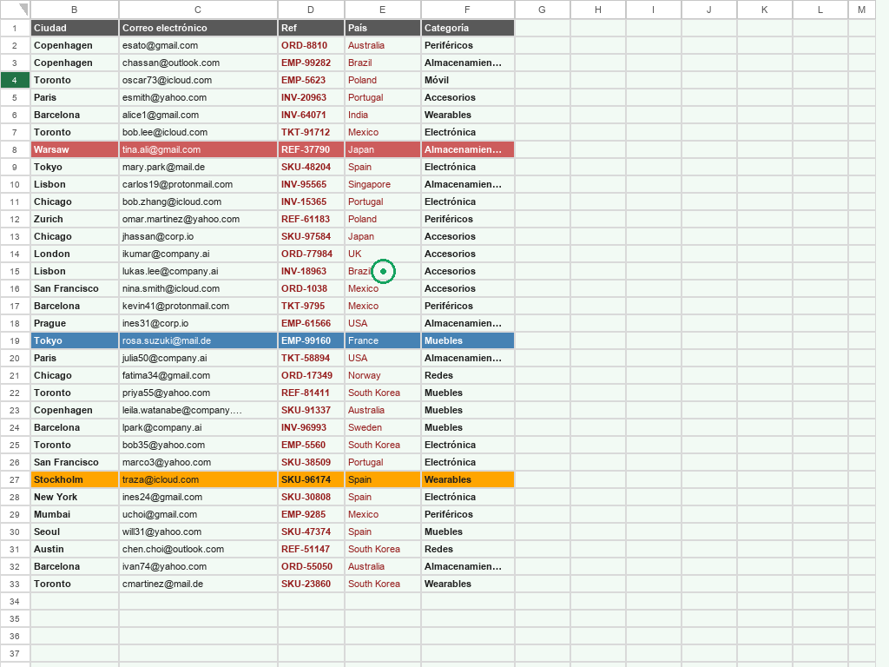
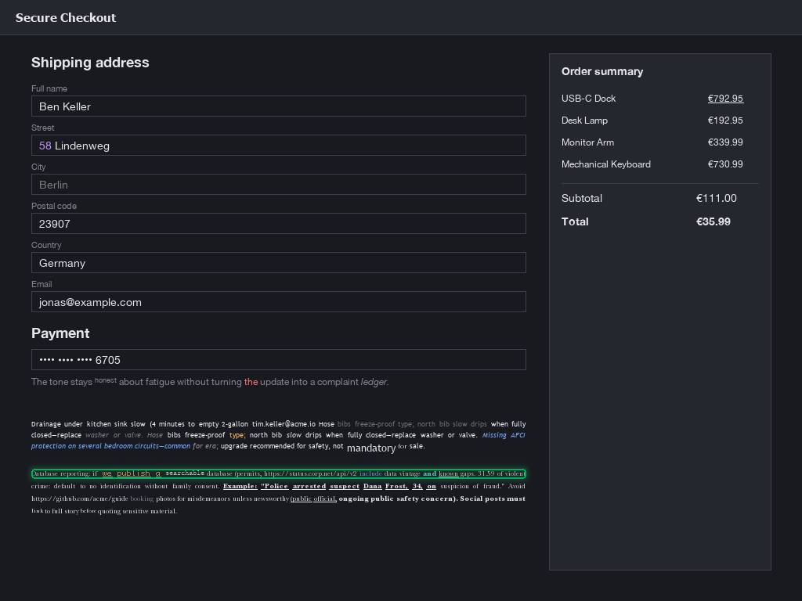
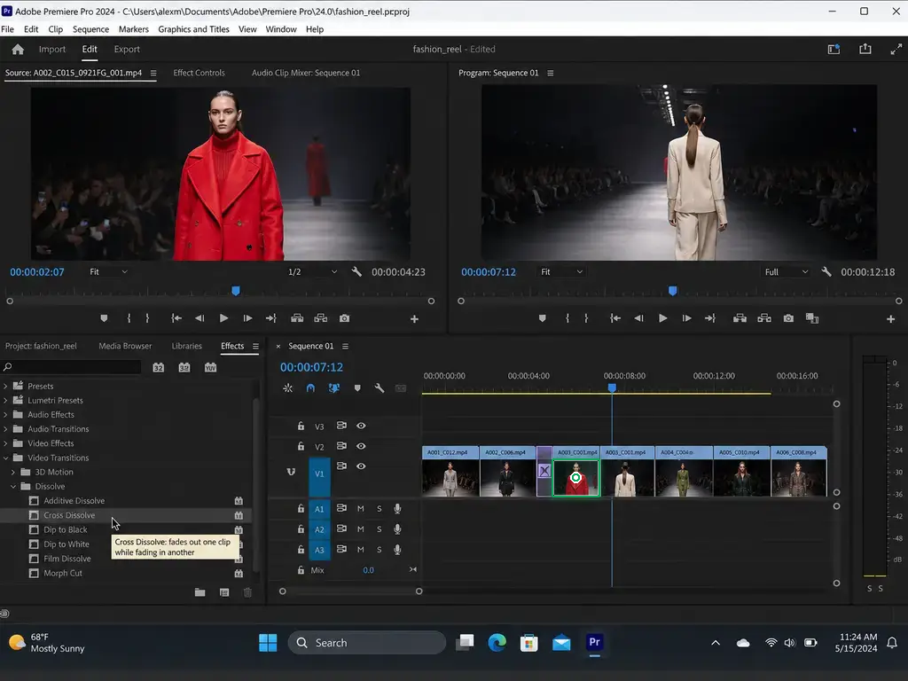

# Pointerbench

Pointerbench is a GUI grounding benchmark suite for computer-use models.

It tests a simple question: given a screenshot and an instruction, can the model point to the right place?

The dataset is hosted on Hugging Face:

https://huggingface.co/datasets/WarmwindOS/pointerbench

This GitHub repository contains the evaluation scripts, metadata files, and release notes. It does not store the PNG screenshots. Download the images from Hugging Face.

## Links

- Blog post: https://about.warmwind.com/pointer-bench/
- Pointer 1.5 post: https://about.warmwind.com/pointer-1-5-teaching-ai-to-click/
- Dataset: https://huggingface.co/datasets/WarmwindOS/pointerbench
- Add your model to the official benchmark leaderboard: https://warmwind.com/contact
- 🔴 Placeholder: Pointer 1.5 model GitHub repository will be added later.

## Subsets

| Subset | Examples | What it tests |
| --- | ---: | --- |
| `pointerbench-sheets` | 500 | Spreadsheet cells, colors, headers, edges, corners, and relative positions |
| `pointerbench-text` | 500 | Words, characters, punctuation, caret positions, chrome text, text bounding boxes, and invoice fields |
| `pointerbench-pro` | 500 | Icons, text, and mixed GUI targets across 100 professional applications |

All examples use 1024x768 screenshots. Each metadata row contains an instruction, target bbox, reference point, answer type, and evaluation rule.

## Examples

The green overlay marks the accepted target geometry.

<p>
  
</p>

`pointerbench-sheets`  
Prompt: `Target cell E15.`  
Expected output: `point [441, 312]`

<p>
  
</p>

`pointerbench-text`  
Prompt: `Need a tight box for the line that starts with «Database reporting: if».`  
Expected output: `bbox [40, 599, 671, 611]`

<p>
  
</p>

`pointerbench-pro`  
Prompt: `Select the red-coat clip.`  
Expected output: `point [649, 538]`

## Repository Contents

```text
pointerbench-sheets/
  eval.py
  data/test/metadata.jsonl
  REPRODUCE.md

pointerbench-text/
  eval.py
  data/test/metadata.jsonl
  REPRODUCE.md

pointerbench-pro/
  eval.py
  data/test/metadata.jsonl
  apps.json
  REPRODUCE.md
```

The GitHub repo includes metadata so you can inspect the benchmark and run scoring code. To run full evaluations, download the images from Hugging Face into the same folder layout.

## Download The Data

```bash
huggingface-cli download WarmwindOS/pointerbench \
  --repo-type dataset \
  --local-dir .
```

This creates the same folder structure used by the scorers.

## Inference Protocol

All screenshots are 1024x768. Run inference in that coordinate frame and return absolute pixel coordinates with origin at the top-left. Do not resize, crop, or normalize the coordinate frame unless you convert predictions back to 1024x768 before scoring.

Each scorer includes the recommended prompt:

```bash
python eval.py --show-system-prompt
```

Default system prompt:

```text
You are evaluating Pointerbench, a GUI grounding benchmark. You will receive one 1024x768 screenshot and one task instruction. Use absolute pixel coordinates with origin at the top-left of the image. Do not return normalized coordinates. Do not crop or resize the coordinate frame. For point tasks, return JSON like {"point": [x, y]}. For bounding-box tasks, return JSON like {"bbox": [x0, y0, x1, y1]}.
```

You can edit this prompt for your inference stack. Keep the coordinate frame and output format fixed, and report any image resizing or multi-step zoom strategy with your results.

## Prediction Format

Predictions are JSONL. Use one row per example.

Point examples:

```json
{"id": "pbs_0001", "point": [100, 151]}
```

Bbox examples:

```json
{"id": "pbt_0002", "bbox": [306, 560, 340, 579]}
```

Point tasks are correct when the predicted point lands inside the target bbox.
Bbox tasks (Pointerbench-Text) use an asymmetric overlap rule: a hit requires the
ground truth to be almost fully covered (coverage >= 0.90) and the prediction to
stay reasonably tight around it (precision >= 0.70). This penalises predictions
that cut off part of the target far more than predictions that wrap it with some
margin.

## Evaluate

Run the scorer from the subset folder:

```bash
cd pointerbench-sheets
python eval.py --predictions preds.jsonl
```

```bash
cd pointerbench-text
python eval.py --predictions preds.jsonl
```

```bash
cd pointerbench-pro
python eval.py --predictions preds.jsonl
```

Each scorer uses only the Python standard library.

## License

Dataset images and annotations are released under CC BY 4.0.
The included evaluation scripts are released under MIT.
